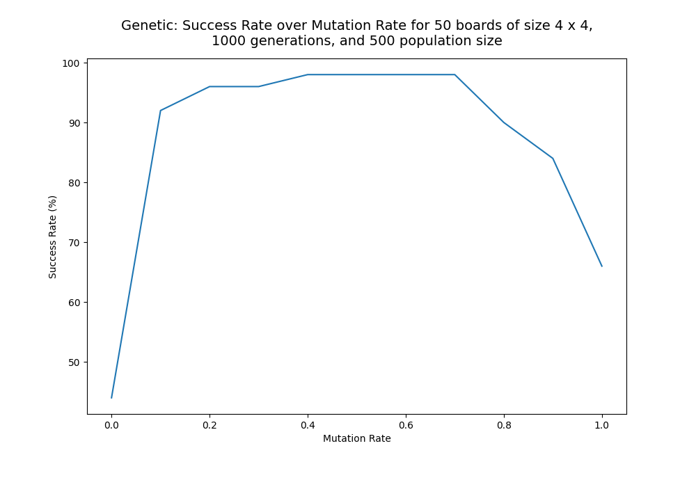

# Calcudoku Solver - AI Final Project 2024
# By Daniel Sinai, Daniel Lavi and Ofek Moshe

## Table of Contents
1. [Introduction](#introduction)
2. [Project Overview](#project-overview)
3. [Solvers Implemented](#solvers-implemented)
4. [Key Features](#key-features)
5. [Pre-requisites](#pre-requisites)
6. [Running the Solvers](#running-the-solvers)
   1. [Basic Usage](#basic-usage)
      1. [Solvers Options](#solvers-options)
      2. [DFS Options](#dfs-options)
      3. [CSP Options](#csp-options)
      4. [Hill Climbing Options](#hill-climbing-options)
      5. [Genetic Algorithm Options](#genetic-algorithm-options)
   2. [Measure Performance](#measure-performance)
      1. [Baseline Performance Measurement](#baseline-performance-measurement)
      2. [CSP Performance Measurement](#csp-performance-measurement)
      3. [Hill Climbing Performance Measurement](#hill-climbing-performance-measurement)
      4. [Genetic Algorithm Performance Measurement](#genetic-algorithm-performance-measurement)

## Introduction
This project implements a series of artificial intelligence (AI) techniques to solve the Calcudoku puzzle. 
Calcudoku is a mathematical and logical puzzle, similar to Sudoku, where a grid is filled with numbers such 
that no number repeats in any row or column, and groups of cells (called "cages") must satisfy mathematical 
constraints (e.g., addition, subtraction, multiplication, etc.).<br>
This is how a Calcudoku puzzle looks like:<br>


## Project Overview
The goal of this project is to solve Calcudoku puzzles using various AI techniques, including
Constraint Satisfaction Problem (CSP) solvers, Genetic Algorithms, and Local Search methods.
Each method has its strengths, and this project provides an analysis of their performance based
on various metrics like the number of backtracks, assignments, board validations and success rate.
You can watch the following video to get a better understanding of the project:<br>
<video src="https://github.com/user-attachments/assets/88f69072-b688-4bbf-8f60-e451e40ac380" />

## Solvers Implemented
The project implements the following Solvers:
1. **Constraint Satisfaction Problem (CSP)** Solvers
    - **Backtracking (BT):** A basic CSP solver that uses backtracking to explore the solution space.
    - **Forward Checking:** A constraint propagation technique which prunes the search space early by checking constraints as variables are assigned. It is an improvement over the basic backtracking algorithm.
    - **Arc Consistency (AC):** A more advanced constraint propagation technique that enforces arc consistency on the constraints, further pruning the search space. It is more powerful than forward checking and can detect inconsistencies earlier.
    - **Heuristics:** The solvers use various heuristics such as:
      - **Minimum Remaining Values (MRV):** Selects the variable with the fewest legal values remaining.
      - **Degree Heuristic:** Selects the variable with the most constraints on remaining variables. It's used to break ties between different MRV possibilities.
      - **Least Constraining Value (LCV):** Selects the value that rules out the fewest values in the remaining variables.
2. **Local Search** solvers:
    - **Hill Climbing:** A basic local search algorithm that starts from a random solution and iteratively makes small changes to the solution, moving in the direction of improving the objective function (in this case, reducing conflicts in the Calcudoku board). It can get stuck in local optima.
    - **Genetic Algorithm (GA):** A population-based search algorithm inspired by the process of natural selection. It maintains a population of candidate solutions and evolves them over generations using genetic operators like selection, crossover, and mutation. It can explore a larger search space and escape local optima.
3. **Baseline Solver:**
    - **DFS Solver:** A simple depth-first search algorithm that explores the solution space by assigning values to variables and backtracking when it reaches a dead-end. It doesn't use any heuristics or improvement techniques, making it the slowest and simplest solver among the implemented solvers. It is primarily used as a baseline to compare the performance of the other solvers and to show the progress made by the more advanced solvers.
   
## Key Features
- **Flexible Puzzle Generation:** The project includes a Calcudoku puzzle generator that can create puzzles of varying sizes. 
- **Performance Measurement:** For each solver, the project measures key performance metrics like the number of backtracks, assignments, and board validations. 
- **Multiple Solvers:** Easily switch between solvers or run them all to compare their performance on the same puzzle.

## Pre-requisites
- Python 3.9 or higher
- Install dependencies using:
    ```bash
    pip install -r requirements.txt
    ```

## Running the Solvers
> The project provides a command-line interface (CLI) to run the solvers on Calcudoku puzzles. The command-line interface allows you to specify which solver to run, the size of the puzzle, and other parameters. Below is an explanation of how to use the solvers and how to measure their performance.

### Basic Usage
To run a solver on a single Calcudoku puzzle, use the following command:<br>
```bash
python run.py solve [solver] [OPTIONS]
```
where `[solver]` is the name of the solver you want to use and `[OPTIONS]` are the solver-specific options.
The available solvers are:
- `csp` for Backtracking Algorithm.
- `hill-climbing` for Hill Climbing Algorithm.
- `genetic` for Genetic Algorithm.

#### Solvers Options
For all solvers, you can specify the size of the puzzle using the `--size` option. The size represents the number of rows/columns in the puzzle.
The default size is 3x3.<br>

#### DFS Options
The DFS solver don't have any specific options other than the puzzle size. You can run it with the size of the puzzle only.<br>
For example, to run the DFS solver on a 3x3 Calcudoku puzzle, use the following command:<br>
```bash
python run.py solve dfs --size 3
````

##### CSP Options
- `--use-forward-checking`: Whether to use forward checking constraints propagation or not. If specified, the solver will use forward checking.
- `--use-arc-consistency`: Whether to use arc consistency constraints propagation or not. If specified, the solver will use arc consistency.
- `--select-unassigned-var`: Unassigned variable selection heuristic. options: `mrv`, `none`. Default: `none`.
- `--order-domain-values`: Domain value ordering heuristic. options: `lcv`, `random`. Default: `random`.

For example, to run the Backtracking solver on a 6x6 Calcudoku puzzle with Arc-Consistency constraints propagation and MRV heuristic, use the following command:<br>
```bash
python run.py solve csp --size 6 --use-arc-consistency --select-unassigned-var mrv
```

##### Hill Climbing Options
- `iterations`: The maximal number of iterations to run the Hill Climbing algorithm. Default: 50.
For example, to run the Hill Climbing solver on a 4x4 Calcudoku puzzle with 100 iterations, use the following command:<br>
```bash
python run.py solve hill-climbing --size 4 --iterations 100
```

##### Genetic Algorithm Options
- `--generations`: The number of generations to run the Genetic Algorithm. Default: 50.
- `--mutation-rate`: The probability of mutation for each individual in the Genetic Algorithm. Default: 0.3.
- `--population-size`: The size of the population for the Genetic Algorithm. Default: 5.

For example, To run the Genetic Algorithm solver on a 5x5 Calcudoku puzzle with a population size of 5000, 150 generations and mutation rate 0.6, use the following command:<br>
```bash
python run.py solve genetic --size 5 --population-size 5000 --generations 150 --mutation-rate 0.6
```

### Measure Performance
The solvers automatically track and report performance metrics.<br>

**DFS** Solver has the following metrics:
- **Time:** Time taken to solve the puzzle.

**CSP** solvers has the following metrics:
- **Backtracks:** Number of times the solver had to backtrack and change previous assignments.
- **Assignments:** Total number of variable assignments made during the algorithm.
- **Board Validations:** Number of times the board is validated against the puzzle constraints.
- **Time:** Time taken to solve the puzzle.
- **Success Rate:** Percentage of successful solutions, where a successful solution is a solution that satisfies all constraints and obtained within the timeout.

**Genetic** Solver has the following metrics:
- **Generations:** Number of generations taken to solve the puzzle.
- **Time:** Time taken to solve the puzzle.
- **Success Rate:** Percentage of successful solutions, where a successful solution is a solution that satisfies all constraints and obtained within the timeout.

**Hill Climbing** Solver has the following metrics:
- **Conflicts:** Number of conflicts in the final solution.

You can compare the performance of different solvers by running them on multiple puzzles and comparing the metrics (see commands below).<br>
For almost all types of measurements you can plot a graph to visually compare the performance of the different solvers.
If you choose to plot a graph, you will be able to see it under a folder named `graphs` in the project directory.

#### Baseline Performance Measurement
The baseline chosen for this problem is a naive DFS. The DFS solver is the simplest solver that can solve the Calcudoku puzzle.
It uses a depth-first search algorithm to explore the solution space and find a valid solution.
The solver doesn't use any heuristics or constraint propagation techniques, making it the slowest solver among the implemented solvers.
It simply assigns values to variables and backtracks when it reaches a dead-end, until it finds a valid solution.<br>
For this reason, the DFS solver is used as a baseline to compare the performance of the other solvers.<br>
For this measurement, the run time of the DFS solver is compared to the run time of the AC-FC-MRV and Genetic Algorithm solvers,
which are the best solvers among CSP and Local Search solvers.<br>

You can compare the average time taken by the DFS, AC-FC-MRV, and Genetic Algorithm solvers to solve a multiple Calcudoku puzzles with the same size using the following command:
```bash
python run.py baseline-compare [OPTIONS]
```

where `[OPTIONS]` are the options for the performance measurement. The available options are:
- `--size`: The size of the puzzles to compare. Default: 3.
- `--amount`: Amount of boards to generate for comparison. Default: 100.
- `--timeout`: The maximum time in seconds to allow the solver to run before timing out. Default: 10.
- `--graphs`: Whether to plot a graph for the performance metric. If specified, the program will plot a graph comparing the performance of different solvers.
- `--generations`: The maximal number of generations to run the Genetic Algorithm. Default: 50.
- `--mutation-rate`: The probability of mutation for each individual in the Genetic Algorithm. Default: 0.5.
- `--population-size`: The size of the population for the Genetic Algorithm. Default: 10.

For example, to compare the performance of the DFS, AC-FC-MRV, and Genetic Algorithm
solvers on 200 4x4 Calcudoku puzzles with timeout of 30 seconds, plot a graph and the following
parameters for the Genetic solver: 100 generations, 0.6 mutation rate, 2000 population size, use the following command:
```bash
python run.py baseline-compare --size 4 --amount 200 --timeout 30 --generations 100 --mutation-rate 0.6 --population-size 2000 --graphs
````

The program will generate a single graph for the performance metric of the DFS, AC-FC-MRV, and Genetic Algorithm solvers on 4x4 Calcudoku puzzles:<br>


> **NOTICE:** The average time is taken over all boards that were solved successfully without timeout. If the solver fails to solve a board within the timeout, it is considered a failure.

#### CSP Performance Measurement
The CSP solvers provide two types of performance measurements:
1. Compare between the backtracks, assignments, and board validations metrics averaged on multiple puzzles with the same size.
2. Get the average time taken to solve multiple puzzles with the same size, and the success rate of the solver on the puzzles.

For the first type of measurements, you can compare the metrics on a group of pre-defined solvers and see which one performs better. The group of solvers is determined by the size of the puzzle.<br>

For each board size, the solvers are grouped as follows:
- `3&below`: bt, bt-mrv, bt-lcv, bt-mrv-lcv, fc, fc-mrv, fc-lcv, fc-mrv-lcv, ac, ac-mrv, ac-lcv, ac-mrv-lcv, fc-ac, fc-ac-mrv, fc-ac-mrv-lcv.
- `4&below`: fc, fc-mrv, fc-lcv, fc-mrv-lcv, ac, fc-ac, ac-mrv, ac-lcv, ac-mrv-lcv, fc-ac-mrv, fc-ac-mrv-lcv.
- `5&below`: fc-mrv, ac, fc-ac, ac-mrv, ac-lcv, ac-mrv-lcv, fc-ac-mrv, fc-ac-mrv-lcv.
- `6&below`: ac, fc-ac, ac-mrv, ac-lcv, ac-mrv-lcv, fc-ac-mrv, fc-ac-mrv-lcv.
- `7&below`: ac-mrv-lcv, fc-ac-mrv, fc-ac-mrv-lcv

where 'bt' stands for Backtracking, 'fc' stands for Forward Checking, 'ac' stands for Arc Consistency, 'mrv' stands for Minimum Remaining Values, and 'lcv' stands for Least Constraining Value.<br>

For the first type of measurements, you can use the command:

```bash
python run.py csp compare [OPTIONS]
```

where `[OPTIONS]` are the options for the performance measurement. The available options are:
- `--size`: The size of the puzzles to compare. Default: 3.
- `--amount`: Amount of boards to generate for comparison. Default: 10.
- `--group`: Group of solvers to compare. Options: `3&below`, `4&below`, `5&below`, `6&below` and `7&below`. Default: `3&below`.
- `--graphs`: Whether to plot graphs for the performance metrics. If specified, the program will plot graphs comparing the performance of different solvers.

For example, to compare the performance of CSP solvers on 50 4x4 Calcudoku puzzles and plot graphs for each metric, use the following command:
```bash
python run.py csp compare --size 4 --amount 50 --group '4&below' --graphs
```
The program will generate 3 graphs for each performance metric of the CSP solvers on 4x4 Calcudoku puzzles.<br>
For example, this is a backtracks metric output graph:<br>


For the second type of measurements, you can compare the time it takes to a CSP solver to solve different puzzles with the same size. 
The time is measured in seconds and is averaged over all puzzles that was solved successfully without timeout.<br>
The 'Success Rate' metric is also provided, which shows the percentage of puzzles that were solved successfully within the timeout.
If the solver fails to solve a puzzle within the timeout, it is considered a failure.<br>
If 10 timeouts occurs in a row, the program will stop measuring time and show the results.<br>

For the second type of measurements, you can use the command:

```bash
python run.py csp time-measurement [OPTIONS]
```

where `[OPTIONS]` are the options for the time measurement. The available options are:
- `--size`: The size of the puzzles to measure time for. Default: 3.
- `--amount`: Amount of boards to generate for time measurement. Default: 10.
- `--solver`: The name of the CSP solver to measure time for. Options: "bt", "bt-mrv", "bt-lcv", "bt-mrv-lcv", "fc",
"fc-mrv", "fc-lcv", "fc-lcv-mrv", "ac-fc", "ac-fc-mrv", "ac-fc-lcv-mrv", "ac", "ac-mrv", "ac-lcv", "ac-lcv-mrv". Default: `bt`.
- `--timeout`: The maximum time in seconds to allow the solver to run before timing out. Default: 30.

> **NOTE:** For this type of measurement, you don't have the option to plot graphs.

For example, to measure the time taken by the Backtracking solver to solve 10 4x4 Calcudoku puzzles with Forward Checking 
and MRV heuristic and 30 seconds timeout, use the following command:

```bash
python run.py csp time-measurement --size 4 --amount 10 --solver 'fc-mrv' --timeout 30
```

The output will show the average time taken by the solver to solve the puzzles and the success rate:
```
*************************************************************************************************************
*** Running CSP time measurement for "fc-mrv" solver with 10 4X4 generated boards with 30 seconds timeout ***
*************************************************************************************************************
finished board 0, 10 timeouts left
finished board 2, 10 timeouts left
finished board 3, 10 timeouts left
finished board 4, 10 timeouts left
finished board 1, 10 timeouts left
finished board 5, 10 timeouts left
finished board 6, 10 timeouts left
finished board 7, 10 timeouts left
finished board 8, 10 timeouts left
finished board 9, 10 timeouts left
FC-MRV
    - success rate = 100.0%
    - Average seconds to solve board = 0.029
-------------
```

#### Hill Climbing Performance Measurement
The Hill Climbing solver provide two types of performance measurements:
1. Compare the average number of conflicts during multiple iterations on multiple Calcudoku puzzles with the same size.
2. Compare the number of conflicts as a function of the number of iterations on a single Calcudoku puzzle.

For the first type of measurements, you can use the command:
```bash
python run.py hill-climbing iterations [OPTIONS]
```
where `[OPTIONS]` are the options for the performance measurement. The available options are:
- `--size`: The size of the Calcudoku puzzle to perform the measurement. Default: 3.
- `--iterations`: The maximal number of iterations to run the Hill Climbing algorithm. Default: 20.
- `--graphs`: Whether to plot a graph for the performance metric. If specified, the program will plot a graph showing the performance of the solver.

For example, to compare the number of conflicts during 50 iterations of the Hill Climbing solver on a 4x4 Calcudoku puzzle and plot a graph, use the following command:
```bash
python run.py hill-climbing iterations --size 4 --iterations 50 --graphs
```

The program will generate a single graph for the performance metric of the Hill Climbing solver on 4x4 Calcudoku puzzles:<br>


For the second type of measurements, you can use the command:
```bash
python run.py hill-climbing compare [OPTIONS]
```
where `[OPTIONS]` are the options for the performance measurement. The available options are:
- `--size`: The size of the Calcudoku puzzle to perform the measurement. Default: 6.
- `--amount`: Amount of boards to generate for comparison. Default: 30.
- `--iterations`: The maximal number of iterations to run the Hill Climbing algorithm. Default: 15.
- `--increment`: The increment value for the number of iterations. Default: 3.
- `--graphs`: Whether to plot a graph for the performance metric. If specified, the program will plot a graph showing the performance of the solver.

For example, to compare the number of conflicts during 15 iterations of the Hill Climbing solver on 30 6x6 Calcudoku puzzles with an increment of 3 and plot a graph, use the following command:
```bash
python run.py hill-climbing compare --size 6 --amount 30 --iterations 15 --increment 3 --graphs
```

The program will generate a single graph for the performance metric of the Hill Climbing solver on 6x6 Calcudoku puzzles:<br>


#### Genetic Algorithm Performance Measurement
You can compare the performance of the Genetic Algorithm solver in 4 ways:
1. Compare the success rate of the Genetic solver on multiple Calcudoku puzzles of **different** sizes.
2. get the success rate and average generation of the Genetic solver on multiple Calcudoku puzzles of the **same** size.
3. Compare the success rate of the Genetic Algorithm solver on multiple Calcudoku puzzles of the **same** size with different population sizes.
4. Compare the success rate of the Genetic Algorithm solver on multiple Calcudoku puzzles of the **same** size with different mutation rate.

For the first type of measurements, you can use the command:
```bash
python run.py genetic success-rate [OPTIONS]
```
where `[OPTIONS]` are the options for the performance measurement. The available options are:
- `--max-size`: The maximum size of the Calcudoku puzzle to perform the measurement. The Genetic Algorithm solver will run on puzzles from 3x3 to `max-size` x `max-size`. Default: 5.
- `--amount`: Amount of boards to generate for comparison. Default: 50.
- `--generations`: The maximal number of generations to run the Genetic Algorithm. Default: 200.
- `--mutation-rate`: The probability of mutation for each individual in the Genetic Algorithm. Default: 0.5.
- `--population-size`: The size of the population for the Genetic Algorithm. Default: 1000.
- `--graphs`: Whether to plot a graph for the performance metric. If specified, the program will plot a graph showing the performance of the solver.

For example, to compare the success rate of the Genetic Algorithm solver on 50 Calcudoku puzzles of sizes 3x3 to 5x5 with 200 generations, 0.5 mutation rate, 1000 population size and plot a graph, use the following command:
```bash
python run.py genetic success-rate --max-size 5 --amount 50 --generations 200 --mutation-rate 0.5 --population-size 1000 --graphs
```

The program will generate a single graph for the performance metric of the Genetic Algorithm solver on 3x3 to 5x5 Calcudoku puzzles:<br>


For the second type of measurements, you can use the command:
```bash
python run.py genetic benchmark [OPTIONS]
```
where `[OPTIONS]` are the options for the performance measurement. The available options are:
- `--size`: The size of the Calcudoku puzzle to perform the measurement. Default: 3.
- `--amount`: Amount of boards to generate for comparison. Default: 100.
- `--max-generations`: The maximal number of generations to run the Genetic Algorithm. Default: 50.
- `--population-size`: The size of the population for the Genetic Algorithm. Default: 5.
- `--mutation-rate`: The probability of mutation for each individual in the Genetic Algorithm. Default: 0.3.

> **NOTE:** For this type of measurement, you don't have the option to plot a graph.

For example, to compare the success rate of the Genetic Algorithm solver on 100 3x3 Calcudoku puzzles with 50 generations, 0.3 mutation rate, 5 population size, use the following command:
```bash
python run.py genetic benchmark --size 3 --amount 100 --max-generations 50 --population-size 5 --mutation-rate 0.3
```

The output will show the success rate of the Genetic Algorithm solver on 100 3x3 Calcudoku puzzles, and the average number of generations taken to solve the puzzles:
```
*******************************************************************************************
*** Running benchmark for Genetic solver with: 100 boards of size 3X3, 5 population size,
0.3 mutation rate, for maximum 50 generations ***
*******************************************************************************************
2024-09-11 12:54:16.716825: Genetic: Size - 3 x 3, Generations - 50, Mutation Rate - 0.3, Population Size - 5 finished round 0
2024-09-11 12:54:16.723788: Genetic: Size - 3 x 3, Generations - 50, Mutation Rate - 0.3, Population Size - 5 finished round 1
2024-09-11 12:54:16.726311: Genetic: Size - 3 x 3, Generations - 50, Mutation Rate - 0.3, Population Size - 5 finished round 2
2024-09-11 12:54:16.727314: Genetic: Size - 3 x 3, Generations - 50, Mutation Rate - 0.3, Population Size - 5 finished round 3
2024-09-11 12:54:16.729349: Genetic: Size - 3 x 3, Generations - 50, Mutation Rate - 0.3, Population Size - 5 finished round 4
2024-09-11 12:54:16.730343: Genetic: Size - 3 x 3, Generations - 50, Mutation Rate - 0.3, Population Size - 5 finished round 5
...
2024-09-11 12:54:17.009680: Genetic: Size - 3 x 3, Generations - 50, Mutation Rate - 0.3, Population Size - 5 finished round 95
2024-09-11 12:54:17.010058: Genetic: Size - 3 x 3, Generations - 50, Mutation Rate - 0.3, Population Size - 5 finished round 96
2024-09-11 12:54:17.015757: Genetic: Size - 3 x 3, Generations - 50, Mutation Rate - 0.3, Population Size - 5 finished round 97
2024-09-11 12:54:17.018769: Genetic: Size - 3 x 3, Generations - 50, Mutation Rate - 0.3, Population Size - 5 finished round 98
2024-09-11 12:54:17.023763: Genetic: Size - 3 x 3, Generations - 50, Mutation Rate - 0.3, Population Size - 5 finished round 99
Genetic: Size - 3 x 3, Generations - 50, Mutation Rate - 0.3, Population Size - 5
    - Average success rate: 90, Average generation: 17.31
Genetic: Size - 3 x 3, Generations - 50, Mutation Rate - 0.3, Population Size - 5 & 90 & 17.31
-------------
```

For the third type of measurements, you can use the command:
```bash
python run.py genetic population-size [OPTIONS]
```
where `[OPTIONS]` are the options for the performance measurement. The available options are:
- `--size`: The size of the Calcudoku puzzles to perform the measurement. Default: 3.
- `--amount`: Amount of boards to generate for comparison. Default: 50.
- `--generations`: The maximal number of generations to run the Genetic Algorithm. Default: 50.
- `--max-population-size`: The maximal population size to compare. Default: 10.
- `--increment`: The increment value for the population size. Default: 2.
- `--mutation-rate`: The probability of mutation for each individual in the Genetic Algorithm. Default: 0.5.
- `--graphs`: Whether to plot a graph for the performance metric. If specified, the program will plot a graph showing the performance of the solver.

For example, to compare the success rate of the Genetic Algorithm solver on 50 5x5 Calcudoku puzzles with 1000 generations, 0.6 mutation rate, and population sizes from 100 to 500 with an increment of 100 and plot a graph, use the following command:
```bash
python run.py genetic population-size --size 5 --amount 50 --generations 1000 --max-population-size 500 --increment 100 --mutation-rate 0.6 --graphs
```

The program will generate a single graph for the performance metric of the Genetic Algorithm solver on 5x5 Calcudoku puzzles:<br>


For the fourth type of measurements, you can use the command:
```bash
python run.py genetic mutation-rate [OPTIONS]
```
where `[OPTIONS]` are the options for the performance measurement. The available options are:
- `--size`: The size of the Calcudoku puzzles to perform the measurement. Default: 3.
- `--amount`: Amount of boards to generate for comparison. Default: 50.
- `--generations`: The maximal number of generations to run the Genetic Algorithm. Default: 50.
- `--population-size`: The size of the population for the Genetic Algorithm. Default: 10.
- `--graphs`: Whether to plot a graph for the performance metric. If specified, the program will plot a graph showing the performance of the solver.

For example, to compare the success rate of the Genetic Algorithm solver on 50 4x4 Calcudoku puzzles with 1000 generations, 500 population size and plot a graph, use the following command:
```bash
python run.py genetic mutation-rate --size 4 --amount 50 --generations 1000 --population-size 500 --graphs
```

The program will generate a single graph for the performance metric of the Genetic Algorithm solver on 4x4 Calcudoku puzzles:<br>

